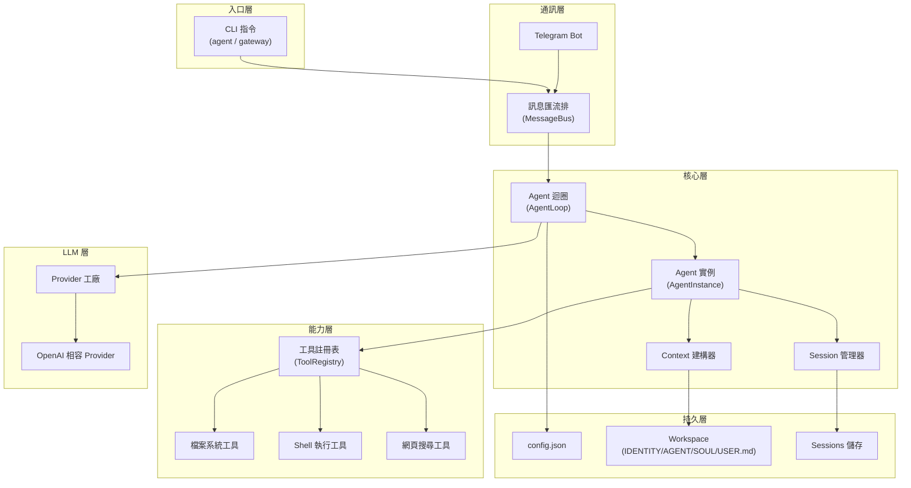

# 架構設計與資料流

本文件為 [MVP_SPEC.md](../MVP_SPEC.md) 的補充，詳述系統內部的模組互動、核心介面定義與資料流。

---

## 系統架構總覽



---

## 核心介面定義

### 1. LLMProvider 介面

```go
// LLMProvider 是所有 LLM 供應商的統一介面
type LLMProvider interface {
    // Chat 發送訊息給 LLM 並取得回應
    // messages: 對話歷史（含系統 prompt）
    // tools: 可用工具定義（JSON Schema 格式）
    // model: 模型名稱（如 "gpt-4"）
    // options: 額外參數（temperature, max_tokens 等）
    Chat(
        ctx context.Context,
        messages []Message,
        tools []ToolDefinition,
        model string,
        options map[string]any,
    ) (*LLMResponse, error)

    // GetDefaultModel 取得此 provider 的預設模型名稱
    GetDefaultModel() string
}
```

### 2. Tool 介面

```go
// Tool 是所有工具的統一介面
type Tool interface {
    Name() string                                          // 工具名稱
    Description() string                                   // 描述（LLM 用）
    Parameters() map[string]any                            // JSON Schema 參數定義
    Execute(ctx context.Context, args map[string]any) *ToolResult  // 執行
}
```

### 3. 核心資料結構

```go
// Message 代表對話中的一則訊息
type Message struct {
    Role       string     // "system" | "user" | "assistant" | "tool"
    Content    string     // 訊息內容
    ToolCalls  []ToolCall // LLM 請求的工具呼叫（assistant 角色時存在）
    ToolCallID string     // 對應的 tool call ID（tool 角色時存在）
}

// ToolCall 代表 LLM 要求呼叫的工具
type ToolCall struct {
    ID       string       // 唯一 ID
    Type     string       // "function"
    Function FunctionCall // 函式呼叫細節
}

// FunctionCall 包含函式名稱與 JSON 格式的參數
type FunctionCall struct {
    Name      string // 工具名稱
    Arguments string // JSON 格式的參數字串
}

// LLMResponse 是 LLM 的回應
type LLMResponse struct {
    Content   string     // 文字回應
    ToolCalls []ToolCall // 工具呼叫請求
    Usage     UsageInfo  // Token 用量
}

// ToolResult 是工具執行的結果
type ToolResult struct {
    ForLLM  string // 回饋給 LLM 的結果文字
    IsError bool   // 是否為錯誤
}

// ToolDefinition 是給 LLM 的工具定義
type ToolDefinition struct {
    Type     string                // "function"
    Function ToolFunctionDefinition
}

type ToolFunctionDefinition struct {
    Name        string         // 工具名稱
    Description string         // 工具描述
    Parameters  map[string]any // JSON Schema
}
```

---

## Agent 核心迴圈詳細流程

```mermaid
sequenceDiagram
    participant U as 使用者/Telegram
    participant BUS as 訊息匯流排
    participant LOOP as AgentLoop
    participant CTX as Context建構
    participant SESS as Session
    participant LLM as LLM Provider
    participant TOOLS as 工具註冊表

    U->>BUS: 發送訊息
    BUS->>LOOP: InboundMessage

    LOOP->>CTX: 建構系統 Prompt
    Note over CTX: 讀取 IDENTITY.md<br>+ AGENT.md<br>+ SOUL.md<br>+ USER.md<br>+ 可用工具列表

    LOOP->>SESS: 載入對話歷史
    SESS-->>LOOP: []Message

    LOOP->>LOOP: 組裝完整 messages<br>(system + history + user)

    loop 工具迴圈（最多 N 次）
        LOOP->>LLM: Chat(messages, tools)
        LLM-->>LOOP: LLMResponse

        alt 回應包含文字
            LOOP-->>BUS: 文字回應
            BUS-->>U: 回覆
        else 回應包含工具呼叫
            LOOP->>TOOLS: Execute(tool_name, args)
            TOOLS-->>LOOP: ToolResult
            LOOP->>LOOP: 將工具結果加入 messages
            Note over LOOP: 繼續迴圈
        end
    end

    LOOP->>SESS: 儲存對話歷史
```

---

## 設定檔載入優先序

```
1. 預設值（程式碼內建）
       ↓
2. config.json 檔案
       ↓
3. 環境變數覆寫（APPNAME_SECTION_KEY）
```

---

## 安全沙箱機制

當 `restrict_to_workspace: true` 時：

| 工具 | 限制行為 |
|------|----------|
| `read_file` | 檢查路徑是否在 workspace 內，拒絕 `..` 跳脫 |
| `write_file` | 同上 |
| `list_dir` | 同上 |
| `edit_file` | 同上 |
| `append_file` | 同上 |
| `exec` | 指令路徑必須在 workspace 內 + 封鎖危險指令 |

**路徑檢查邏輯：**
1. 將輸入路徑轉為絕對路徑
2. 確認絕對路徑以 workspace 路徑為前綴
3. 拒絕包含 `..` 的路徑嘗試

---

## Provider 工廠模式

使用 `vendor/model` 格式字串自動路由到對應的 Provider：

```
"openai/gpt-4"      → OpenAI Provider (api.openai.com)
"zhipu/glm-4"       → OpenAI 相容 Provider (open.bigmodel.cn)
"deepseek/chat"     → OpenAI 相容 Provider (api.deepseek.com)
"ollama/llama3"     → OpenAI 相容 Provider (localhost:11434)
```

每個 vendor 有預設的 `api_base`，使用者可在 `model_list` 中覆寫：

```json
{
  "model_name": "my-model",
  "model": "openai/gpt-4",
  "api_base": "https://my-proxy.com/v1",
  "api_key": "sk-..."
}
```

---

## 訊息匯流排（MessageBus）

MessageBus 作為頻道與 Agent 之間的中間層：

```
Telegram Channel ─┐
                  ├─→ MessageBus ─→ AgentLoop ─→ LLM
CLI Input ────────┘                      ↓
                                    MessageBus ─→ 回覆到對應頻道
```

**InboundMessage 結構：**
- `Channel`: 來源頻道（"telegram" / "cli"）
- `ChatID`: 聊天 ID（用於路由回覆）
- `Content`: 訊息內容
- `SessionKey`: 對話 Session 識別鍵

---

## Workspace 身份檔案用途

| 檔案 | 用途 | 載入時機 |
|------|------|----------|
| `IDENTITY.md` | Agent 的自我描述（名稱、能力、目標）| 系統 Prompt 建構時 |
| `AGENT.md` | Agent 行為指引（何時使用工具、如何回應）| 系統 Prompt 建構時 |
| `SOUL.md` | Agent 的個性（友善、簡潔、誠實等）| 系統 Prompt 建構時 |
| `USER.md` | 使用者偏好（語言、時區、風格）| 系統 Prompt 建構時 |
| `memory/MEMORY.md` | 長期記憶（Agent 自主寫入的重要資訊）| 系統 Prompt 建構時 |

這些檔案的內容會被讀取並組合成 LLM 的 `system` 訊息，讓 Agent 具備可自訂的人格與行為。
